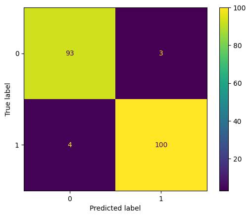
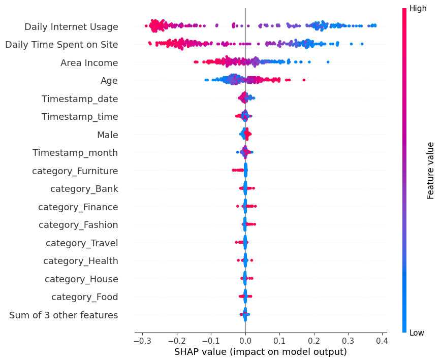

# **Predict Customer Clicked Ads Classification by Using Machine Learning**

- Dataset: Sourced from Rakamin Academy.
- Programming Language: Python Version 3.10.11
- Library:
    - pandas version 2.0.1
    - matplotlib version 3.7.1
    - seaborn version 0.12.2
    - numpy version 1.24.3
    - math
    - imblearn
    - sklearn version 1.2.2
    - shap 0.42.1

# Overview

A company based in Indonesia is seeking to assess the effectiveness of its broadcasted advertisements. Understanding the success of these marketing efforts is crucial for attracting customers and optimizing the impact of the advertisements. By analyzing historical advertisement data and extracting insights and patterns, the company aims to gain valuable information for setting marketing targets.

The primary objective of this case is to develop a machine learning classification model. This model is designed to identify and classify the right target customers, allowing the company to optimize its marketing strategy. Through the analysis of historical data, the goal is to create a predictive model that can efficiently determine the likelihood of customer engagement with the advertisements. This, in turn, will enable the company to tailor its marketing efforts to reach the most receptive audience, ultimately enhancing the overall effectiveness of its advertising campaigns.

# Data Understanding
The source dataset is obtained from Rakamin Academy and comprises 10 features with a total of 1000 rows. The features are described as follows:

| Features                | Description                                            |
|-------------------------|--------------------------------------------------------|
| Daily Time Spent on Site | Time spent by customers on a site in minutes            |
| Age                     | Customer's age                                         |
| Area Income             | Average income in the customer's area                   |
| Daily Internet Usage    | Average daily time customers use the internet (in minutes)      |
| Male                    | Gender of the customer (female/male)                   |
| Timestamp_date               | Date when customers view the ads                        |
| Timestamp_month               | Month when customers view the ads                        |
| Timestamp_year               | Year when customers view the ads                        |
| Timestamp_time               | Time when customers view the ads                        |
| Clicked on Ad           | Whether the customer clicked on the ads (Yes/No)        |
| City                    | Customer's city address                                |
| Province                | Customer's province address                            |
| Category                | Category of the ads                                     |

# EDA (Exploratory Data Analysis)
- Gender

Analyzing the distribution of gender, it is observed that the number of data for 'Perempuan' and 'Laki-Laki' is relatively balanced. However, a notable observation is that 'Perempuan' is more likely to click on ads compared to 'Laki-Laki.' This observation leads to the assumption that the higher click rate among women may be attributed to the likelihood that most advertisements pertain to products predominantly used by women. This insight highlights the potential influence of gender in ad engagement and could inform targeted marketing strategies.

- Age

Analyzing the age distribution, it is observed that the majority of customers in the Middle Adults and Old Adults groups tend to click on ads. In contrast, among Young Adults, the majority of customers do not click on ads. This insight highlights variations in ad engagement patterns across different age groups, suggesting that marketing strategies may need to be tailored to the preferences and behaviors of specific age demographics.

- Daily Time Spent on Site

The analysis of the time spent on the site reveals an interesting trend: as the time spent on the site increases, the likelihood of customers not clicking on ads also increases. This suggests an inverse relationship between the duration of site engagement and ad click-through rates. Further exploration into the factors influencing this pattern could provide valuable insights for optimizing ad engagement strategies.

- Pairplot

Based on the pair plot analysis, several patterns emerge in the distribution of data across different column relationships:

1. **Daily Time Spent on Site and Age:**
   - When the daily time spent on the site is long and the age is young, the customer is more likely not to click on ads.

2. **Daily Time Spent on Site and Area Income:**
   - When the daily time spent on the site is long and the area income is high, the customer is more likely not to click on ads.

3. **Daily Time Spent on Site and Daily Internet Usage:**
   - When both daily time spent on the site and daily internet usage are long, the customer is more likely not to click on ads.

4. **Age and Area Income:**
   - When the age is young and the area income is high, the customer is more likely not to click on ads.

5. **Age and Daily Internet Usage:**
   - When the age is young and the daily internet usage is long, the customer is more likely not to click on ads.

6. **Area Income and Daily Internet Usage:**
   - When the area income is high and daily internet usage is long, the customer is more likely not to click on ads.

These patterns provide valuable insights into potential relationships between different features and the likelihood of customers clicking on ads. Understanding these patterns can inform targeted marketing strategies.

# Data Preprocessing
Before proceeding with modeling, data cleaning, and preprocessing are critical steps to ensure optimal results from the model. The following are data cleaning and preprocessing steps undertaken:
|Preprocessing|Finding|Handling|Explanation|
|-------------|-------|--------|-----------|
|Missing Value|'Daily Time Spent on Site', 'Area Income', 'Daily Internet Usage', and 'Male' has missing value|- 'Daily Time Spent on Site,' 'Area Income,' and 'Daily Internet Usage' columns will be imputed using the median value.  - 'Age' column, considering that 'Perempuan' is more likely to click on ads, the data points where 'Clicked on Ad' is 'Yes' will be filled with 'Perempuan,' while the remaining data points will be filled with 'Laki-Laki.'|- Imputing with the median is a robust method that is less sensitive to outliers, ensuring that the central tendency of the data is maintained without introducing bias.   - 'Age' column filled based on the observed trend in ad engagement|
|Duplicate Value|There is no duplicate value.|-|-|
|Feature Selection|'Daily Time Spent on Site', 'Age	', 'Area Income', 'Daily Internet Usage', 'Male', 'Clicked on Ad', 'category', 'Timestamp_time', 'Timestamp_date', 'Timestamp_month', 'Timestamp_year'|Drop others column|The columns are chosen because the column is related to customers who click the ads and have distinct information.|
|Feature Encoding|This step is only for categorical columns namely 'Male', 'Clicked on Ad', and 'category'.|- Label encoding will be employed for 'Male' and 'Clicked on Ad' columns   - 'Category' will be employing with one-hot encoding|- 'Male' and 'Clicked on Ad' columns, given that these columns have only two distinct values.   - 'Category' column, contains more than two distinct values|
|Splitting Data|-|80% Data Train and 20% Data Test|-|
|Feature Scaling|Varied range of values in each column|MinMaxScaler|To ensure consistency|

# Modeling

<table border="1" class="dataframe">
  <thead>
    <tr style="text-align: right;">
      <th></th>
      <th>Logistic Regression</th>
      <th>Logistic Regression Scaling</th>
      <th>K-Nearest Neighbors</th>
      <th>K-Nearest Neighbors Scaling</th>
      <th>Decision Tree</th>
      <th>Decision Tree Scaling</th>
      <th>Random Forest</th>
      <th>Random Forest Scaling</th>
      <th>Gradient Boost</th>
      <th>Gradient Boost Scaling</th>
    </tr>
  </thead>
  <tbody>
    <tr>
      <th>Train</th>
      <td>0.5</td>
      <td>0.971060</td>
      <td>0.759551</td>
      <td>0.952070</td>
      <td>1.000000</td>
      <td>1.000000</td>
      <td>1.000000</td>
      <td>1.000000</td>
      <td>0.997475</td>
      <td>0.997475</td>
    </tr>
    <tr>
      <th>Test</th>
      <td>0.5</td>
      <td>0.965144</td>
      <td>0.666667</td>
      <td>0.941907</td>
      <td>0.944712</td>
      <td>0.944712</td>
      <td>0.965144</td>
      <td>0.965144</td>
      <td>0.965144</td>
      <td>0.965144</td>
    </tr>
  </tbody>
</table>

- In general, scaling the data produces better results compared to not scaling, as it ensures equal consideration of features by the model (excluding models robust to outliers). 
- The Random Forest Classifier outperforms other models, achieving best performance with a training data score of 1 and a testing data score of 0.965144. 
These findings emphasize the effectiveness of feature scaling and the superiority of the Random Forest Classifier in this dataset.

## Confusion Matrix Best Model (Random Forest)

According to the confusion matrix, the model misclassified 7 out of 200 data points. While any misclassification is notable, the relatively small number suggests that the model performs well in predicting whether a customer will click on ads or not. This accuracy is beneficial as it contributes to more precise targeting of ads to customers, ultimately improving the effectiveness of the advertising strategy.

## Feature Importance

According to feature importance analysis using SHAP values in the Random Forest model, two features stand out with significantly different values compared to others: 'Daily Internet Usage' and 'Daily Time Spent on Site.' These features warrant special attention in target marketing strategies due to their notable impact on the model's predictions. Understanding the influence of these features can help optimize advertising efforts and enhance the effectiveness of targeted marketing initiatives.

# Business Recomendation And Simulation

## Business Recommendation
Based on the Feature Importance analysis, the following business recommendations are suggested for targeted marketing:

- **Daily Internet Usage:**
  - Utilize Daily Internet Usage as a pivotal factor for predicting customer ad engagement. Customers with lower daily Internet usage are more likely to click on ads, making them prime candidates for targeted advertising. Tailor ad content and strategies to capture the attention of this specific segment.

- **Daily Time Spent on Site:**
  - Similar to Daily Internet Usage, consider Daily Time Spent on Site as a significant indicator. Customers with lower time spent on the site are more inclined to click on ads. Design targeted campaigns to attract the attention of this audience.

- **Area Income:**
  - Focus marketing efforts on customers with lower area income, as this group exhibits a higher likelihood of clicking on ads. Tailor promotions or offers to resonate with the preferences and needs of this income segment.

- **Age:**
  - Target older customer demographics for advertising campaigns, as older age groups are more likely to engage with ads. Craft marketing messages and visuals that resonate with the interests and preferences of this age segment.

These recommendations aim to optimize targeted marketing efforts by aligning strategies with the features that exhibit the highest importance in predicting ad engagement.

## Business Simulation
**Assumption**
- The cost of giving ads to customers is Rp. 500.00.
- Revenue from clicked ads is Rp. 2000.00.

**Without Model:**
Without a model, assuming that only 50% of customers click on ads, and with a total of 200 customers, the ads would be given to all customers as there is no prediction available on which customers are more likely to click the ads.

Calculation:
- **Cost:** Cost of giving ads × Number of customers = Rp. 500 × 200 = Rp. 100,000.00
- **Revenue:** Rp. 2000 × (50% of 200) = Rp. 200,000.00
- **Profit:** Revenue - Cost = Rp. 200,000.00 - Rp. 100,000.00 = **Rp. 100,000.00**

**With Model:**
With a model, assuming the model predicts 103 customers as good candidates (with a total of 200 customers) for clicking the ads with an accuracy of 100 out of 103 predicted correctly. Using the model, ads are only given to the predicted good candidates.

Calculation:
- **Cost:** Cost of giving ads × Number of predicted good customers = Rp. 500 × 103 = Rp. 51,500.00
- **Revenue:** Rp. 2000 × 100 = Rp. 200,000.00
- **Profit:** Revenue - Cost = Rp. 200,000.00 - Rp. 51,500.00 = **Rp. 148,500.00**

By utilizing the model, the potential profit can be enhanced by Rp. 48,500.00 (48.5%) compared to the situation without the model. This improvement stems from the model's capacity to predict and focus on customers with a higher likelihood of clicking on ads. As a result, the allocation of advertising resources becomes more optimized, leading to an overall increase in the efficiency of the marketing strategy.
